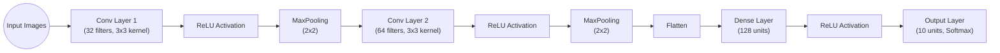

Below is an example of a simple Convolutional Neural Network (CNN) architecture diagram. The diagram is followed by an explanation of each component and how they connect.

---

## Explanation of the CNN Architecture

1. **Input Layer**  
   - **Purpose**: Takes in the raw image data (e.g., 28×28 grayscale images or 224×224 color images).  
   - **Shape**: Depends on the dataset (e.g., **(height, width, channels)**).

2. **Convolution Layer 1**  
   - **Filters**: 32 (number of feature maps or kernels)  
   - **Kernel Size**: 3×3 (typically used in many CNNs, but can vary)  
   - **Purpose**: Automatically learns spatial features by sliding the 3×3 kernels over the input image.

3. **ReLU Activation**  
   - **Rectified Linear Unit** replaces all negative pixel values with zero.  
   - **Purpose**: Introduces non-linearity, enabling the network to learn more complex features.

4. **MaxPooling Layer**  
   - **Pool Size**: 2×2 (a common choice)  
   - **Purpose**: Downsamples the spatial dimensions (height and width), reducing the number of parameters and helping to control overfitting.

5. **Convolution Layer 2**  
   - **Filters**: 64  
   - **Kernel Size**: 3×3  
   - **Purpose**: Learns higher-level or deeper features from the output of the first pooling layer.

6. **ReLU Activation**  
   - Applied again to add non-linear transformations.

7. **MaxPooling Layer**  
   - **Pool Size**: 2×2  
   - Further reduces spatial dimension and extracts more prominent features.

8. **Flatten**  
   - **Purpose**: Converts the 2D (or sometimes 3D) feature maps into a 1D vector, so it can be fed into a fully connected (dense) layer.

9. **Dense Layer (128 units)**  
   - A fully connected layer with 128 neurons.  
   - **Purpose**: Learns to combine the extracted features into more abstract representations that are useful for classification.

10. **ReLU Activation**  
    - Again introduces non-linearity within the dense layer.

11. **Output Layer (Softmax)**  
    - **Units**: 10 (for example, if you have 10 classes to classify—like in MNIST digits).  
    - **Activation**: Softmax, which outputs a probability distribution over the possible classes.

---

### How They Connect
1. **Input images** flow into the first convolution layer.
2. The **convolution** filters extract features; the output is then passed through a **ReLU activation** function to introduce non-linearity.
3. The output of ReLU is **pooled** (MaxPooling), reducing spatial dimensions.
4. A second convolution + ReLU + pooling stack refines the features further.
5. After the second pooling, the feature maps are **flattened** into a 1D vector.
6. The flattened vector is passed to a **fully connected dense layer**, which learns more abstract representations of the data.
7. The final **output layer** with a softmax activation gives class probabilities, allowing for multi-class classification.

