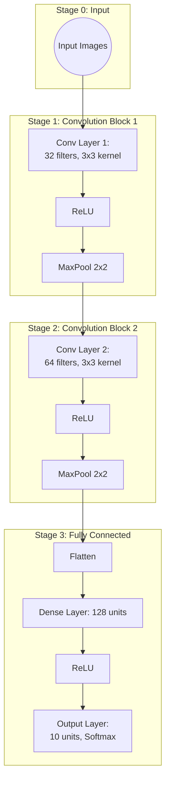

Below is an example of a simple Convolutional Neural Network (CNN) architecture diagram. The diagram is followed by an explanation of each component and how they connect.

> **Note**:  
> - Above is a Mermaid flowchart. You can paste this into a GitHub Markdown file or the [Mermaid Live Editor](https://mermaid.live/edit) to see the rendered diagram.
> - GitHub-flavored Mermaid often supports HTML tags like ` ` in labels. If your particular renderer does not, simply remove ` ` and keep the labels on one line, or explore other layout/styling options.

---

## Explanation of the CNN Architecture

1. **Stage 0 (Input)**
   - **A (Input Images)**: The raw images are fed into the CNN.  
     - Dimensions might be, for example, \(28 \times 28\) for MNIST, or \(32 \times 32\) for CIFAR-10, with 1 or 3 color channels.

2. **Stage 1 (Convolution Block 1)**
   - **B (Conv Layer 1)**: The first convolutional layer with 32 filters (kernels) of size 3×3.  
   - **C (ReLU)**: Applies the Rectified Linear Unit \(\max(0, x)\) to introduce non-linearity.  
   - **D (MaxPool 2×2)**: Downsamples feature maps by taking the maximum value over 2×2 patches, reducing spatial size.

3. **Stage 2 (Convolution Block 2)**
   - **E (Conv Layer 2)**: Another convolutional layer, now with 64 filters (also 3×3).  
   - **F (ReLU)**: Adds non-linearity again.  
   - **G (MaxPool 2×2)**: Further downsampling to reduce the spatial dimensions.

4. **Stage 3 (Fully Connected / Classification)**
   - **H (Flatten)**: Flattens the 2D feature maps into a 1D vector.  
   - **I (Dense Layer with 128 units)**: A fully connected layer that learns to combine extracted features into higher-level representations.  
   - **J (ReLU)**: Continues with a non-linear activation in the dense layer.  
   - **K (Output Layer: 10 units, Softmax)**: Outputs class probabilities (assuming 10 classes) using a Softmax activation.

**Flow**:  
- **Input** → **Conv1** → **ReLU** → **MaxPool** →  
- **Conv2** → **ReLU** → **MaxPool** → **Flatten** →  
- **Dense** → **ReLU** → **Output (Softmax)**

This setup is a classic CNN pipeline commonly used for image classification tasks. You can tweak the number of filters, the kernel sizes, and the number of dense-layer units based on your specific dataset and performance requirements.