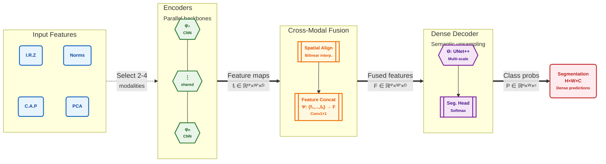

```mermaid
%% --------------------------------------------------
%% Multi-Modal Segmentation Architecture
%% Optimized for A4 paper layout (210mm × 297mm)
%% --------------------------------------------------
flowchart LR
  %% ---------- COMPACT STYLES ----------
  classDef input   fill:#E8F4FD,stroke:#1565C0,stroke-width:2px,color:#0D47A1,font-weight:600,font-size:11px;
  classDef encoder fill:#E8F5E8,stroke:#2E7D32,stroke-width:2px,color:#1B5E20,font-weight:600,font-size:11px;
  classDef fusion  fill:#FFF8E1,stroke:#EF6C00,stroke-width:2px,color:#E65100,font-weight:600,font-size:11px;
  classDef decoder fill:#F3E5F5,stroke:#7B1FA2,stroke-width:2px,color:#4A148C,font-weight:600,font-size:11px;
  classDef output  fill:#FFEBEE,stroke:#C62828,stroke-width:2px,color:#B71C1C,font-weight:600,font-size:11px;

  %% ---------- INPUT GROUPS (COMPACT 2x2) ----------
  subgraph INPUTS ["Input Features"]
    I1("I.R.Z"):::input
    I2("C.A.P"):::input
    I3("Norms"):::input
    I4("PCA"):::input
    I1 ~~~ I2
    I3 ~~~ I4
  end

  %% ---------- ENCODERS (SCIENTIFIC) ----------
  subgraph ENCODERS ["Encoders<br><small>Parallel backbones</small>"]
    E1{{"φ₁<br><small>CNN</small>"}}:::encoder
    E2{{"⋮<br><small>shared</small>"}}:::encoder
    E3{{"φₙ<br><small>CNN</small>"}}:::encoder
    E1 --- E2 --- E3
  end

  %% ---------- FUSION (DETAILED) ----------
  subgraph FUSION ["Cross-Modal Fusion"]
    F1[["Spatial Align<br><small>Bilinear interp.</small>"]]:::fusion
    F2[["Feature Concat<br>Ψ: {f₁,...,fₙ} → F<br><small>Conv1×1</small>"]]:::fusion
    F1 --> F2
  end

  %% ---------- DECODER (TECHNICAL) ----------
  subgraph DECODER ["Dense Decoder<br><small>Semantic upsampling</small>"]
    D1{{"Θ: UNet++<br><small>Multi-scale</small>"}}:::decoder
    D2[["Seg. Head<br><small>Softmax</small>"]]:::decoder
    D1 --> D2
  end

  %% ---------- OUTPUT ----------
  OUT("Segmentation<br><b>H×W×C</b><br><small>Dense predictions</small>"):::output

  %% ---------- FLOW ----------
  INPUTS -.->|"Select 2-4<br><small>modalities</small>"| ENCODERS
  ENCODERS ==>|"Feature maps<br><small>fᵢ ∈ ℝᴴ'×ᵂ'×ᴰ</small>"| FUSION
  FUSION ==>|"Fused features<br><small>F ∈ ℝᴴ'×ᵂ'×ᴰ</small>"| DECODER
  DECODER ==>|"Class probs<br><small>P ∈ ℝᴴ×ᵂ×ᶜ</small>"| OUT
```