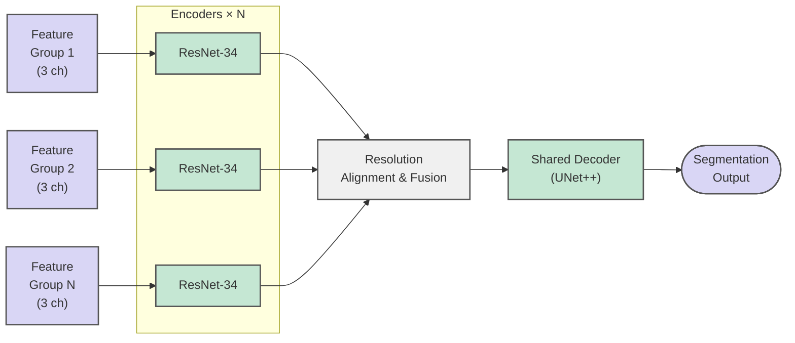

```mermaid
flowchart LR
  classDef data fill:#d9d6f5,stroke:#555,stroke-width:1.8px;
  classDef enc  fill:#c5e7d3,stroke:#555,stroke-width:1.8px;
  classDef op   fill:#f0f0f0,stroke:#555,stroke-width:1.8px;

  FG1["Feature<br>Group 1<br>(3 ch)"]:::data
  FG2["Feature<br>Group 2<br>(3 ch)"]:::data
  FGN["Feature<br>Group N<br>(3 ch)"]:::data

  subgraph ENC["Encoders × N"]
    direction TB
    ENC1["ResNet-34"]:::enc
    ENC2["ResNet-34"]:::enc
    ENCN["ResNet-34"]:::enc
  end

  FUSE["Resolution<br>Alignment & Fusion"]:::op
  DEC["Shared Decoder<br>(UNet++)"]:::enc
  OUT(["Segmentation<br>Output"]):::data

  FG1 --> ENC1
  FG2 --> ENC2
  FGN --> ENCN
  ENC1 & ENC2 & ENCN --> FUSE --> DEC --> OUT

```